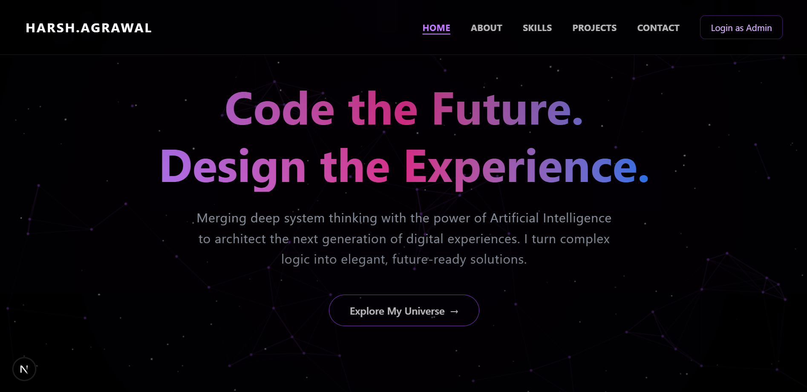
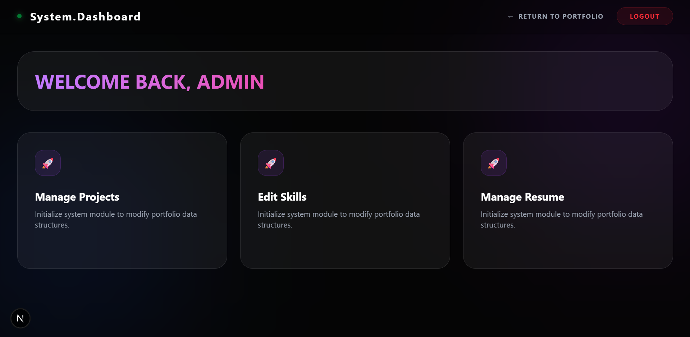
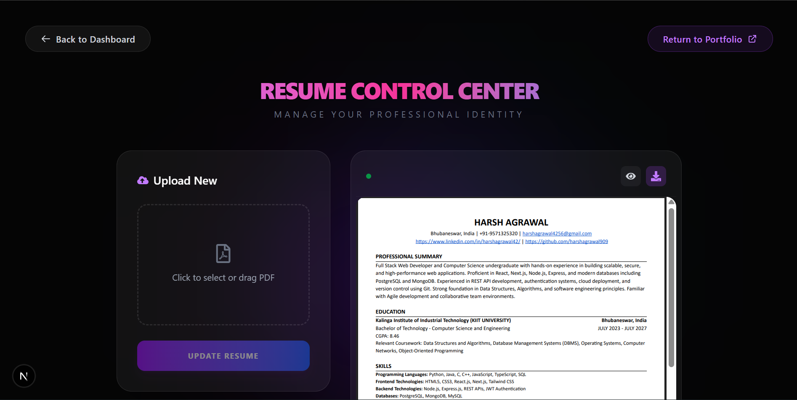

# 🌟 Harsh's Portfolio


A modern developer portfolio built with **Next.js**, **TailwindCSS**, and a **Node.js** backend.  
Includes an admin dashboard to dynamically manage **skills**, **projects**, **certificates**, and **resume** with **MongoDB**.

---

## 🚀 Demo

- 🌐 Frontend (Vercel): https://www.itsharsh.dev/

---

## ✨ Features

- 📱 Responsive modern UI
- 🧠 Skills manager (admin can add/edit/delete skills)
- 🗂️ Project manager (add/edit/delete projects with links)
- 🎓 Certificate manager (showcase certifications with Google Drive integration)
- 📄 Resume manager (upload and display CV)
- 📬 Contact form that sends messages to email (via Web3Forms)
- 🧭 Smooth scrolling navbar with active section detection
- 🔐 Admin authentication (JWT-based)
- 🌐 Google Drive certificate preview support

---

## 🛠️ Tech Stack

### Frontend
- Next.js
- TypeScript
- TailwindCSS

### Backend
- Node.js
- Express.js
- MongoDB (Mongoose)
- Multer (file uploads)

### Deployment
- Vercel (frontend hosting)
- Render (backend hosting)

---

## 📦 Installation

### 1) Clone the repository
```bash
git clone https://github.com/your-username/grand-portfolio.git
cd grand-portfolio
```

### 2) Setup backend
```bash
cd backend
npm install
```

Create a `.env` file inside `backend/` (see Environment Variables section), then run:
```bash
node server.js
```

For development with auto-reload:
```bash
npx nodemon server.js
```

### 3) Setup frontend
```bash
cd ../frontend
npm install
npm run dev
```

Frontend runs on `http://localhost:3000` by default.

---

## 🔑 Environment Variables

### `backend/.env`
```env
PORT=5000
MONGO_URI=your_mongodb_connection_string
JWT_SECRET=your_super_secret_key
R2_ACCOUNT_ID=your_r2_account_id
R2_ACCESS_KEY_ID=your_r2_access_key
R2_SECRET_ACCESS_KEY=your_r2_secret_key
R2_BUCKET_NAME=your_bucket_name
```

### `frontend/.env.local`
```env
NEXT_PUBLIC_API_URL=http://localhost:5000
```

> Note: R2 credentials are used for file uploads (resume manager). The certificate manager supports direct links from Google Drive or image URLs.

---

## 📁 Folder Structure

```bash
my-portfolio/
├── backend/
│   ├── config/
│   ├── controllers/
│   ├── middleware/
│   ├── models/
│   ├── routes/
│   ├── services/
│   ├── src/
│   ├── uploads/
│   ├── package.json
│   └── server.js
└── frontend/
    ├── public/
    ├── src/
    │   ├── app/
    │   ├── components/
    │   └── middleware.ts
    ├── package.json
    └── tsconfig.json
```

---
## 📊 Database Models

### Certificate Model
```javascript
{
  name: String (required),          // Certificate title
  provider: String (required),      // Issuing organization
  description: String (optional),   // Certificate description
  link: String (required),          // Certificate URL/link
  verified: Boolean (optional),     // Verification status
  timestamps: true                  // createdAt, updatedAt
}
```

---
## � Certificate Manager

The portfolio includes a **Certificate Manager** in the admin dashboard where you can:

- ✅ Add certifications with name, issuing provider, description, and link
- ✅ Mark certificates as verified (displays a green badge)
- ✅ Support for **Google Drive** certificate previews (auto-detects Google Drive links)
- ✅ Support for direct image URLs
- ✅ Delete certificates from the dashboard

### How to Add a Certificate

1. Go to `/admin/certificates`
2. Fill in the certificate details:
   - **Certificate Name**: e.g., "Full Stack Web Development"
   - **Provider**: e.g., "Coursera", "Google", "Microsoft"
   - **Description**: (Optional) Brief description of the certificate
   - **Certificate Link**: Link to the certificate (Google Drive or direct image URL)
   - **Is Verified?**: Check if it's an official/verified certificate
3. Click "Launch Certificate"

### Supported Link Formats

- 🔗 **Google Drive**: `https://drive.google.com/file/d/FILE_ID/view?usp=drive_link`
  - Automatically converts to preview format
  - Uses image proxy service for cross-origin access
  
- 🖼️ **Direct Images**: Any image URL (PNG, JPG, etc.)
  - Direct URLs to certificate images
  - Uses microlink.io for screenshot generation

---

## �🖼️ Screenshots

> Replace with actual screenshots from your project.

- 🏠 Home Page  
  

- 🛠️ Admin Dashboard  
  

- 📄 Resume Section  
  

---

## 🔮 Future Improvements

- 🌍 Add multi-language support
- 🧪 Add unit/integration tests for frontend and backend
- 📊 Add analytics dashboard for visitor insights
- 📨 Replace third-party contact API with custom backend mail service
- 🧰 Add role-based admin permissions

---

## 👨‍💻 Author

**Harsh Agrawal**

- GitHub: [@harshagrawal909](https://github.com/harshagrawal909)
- LinkedIn: [Harsh Agrawal](https://www.linkedin.com/in/harshagrawal42)

---

⭐ If you like this project, consider giving it a star on GitHub!
